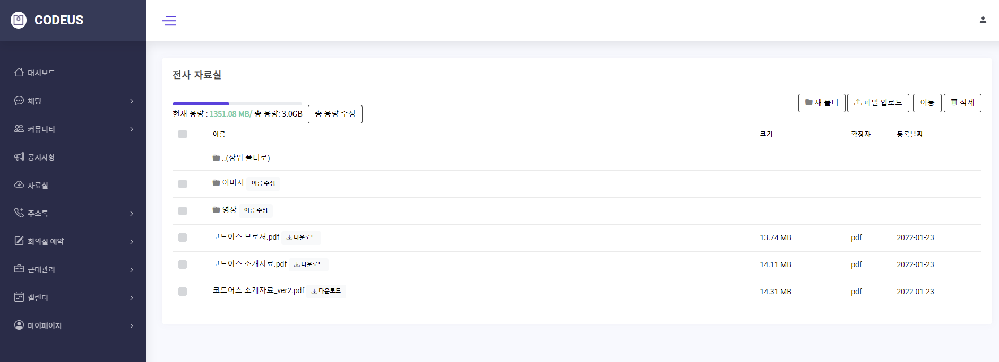

### CODEUS : 그룹웨어 - 통합업무 플랫폼 ( Spring 프로젝트 )

# 목차

- [1. 프로젝트 설명](#1-프로젝트-설명)
  - [1.1. 프로젝트 명](#12-프로젝트-명)
  - [1.2. 프로젝트 기간](#11-프로젝트-기간)
  - [1.3. 프로젝트 인원](#13-프로젝트-인원)
  - [1.4. 프로젝트 개요](#14-프로젝트-개요)
  - [1.5. 개발환경](#15-개발환경)
  - [1.6. 주요 기능](#17-주요-기능)
  - [1.7. 담당 역할](#18-담당-역할)
  - [1.8. 느낀 점](#19-느낀-점)
- [2. 프로젝트 기획 및 설계](#2-프로젝트-기획-및-설계)
  - [2.1. 기획](#21-기획)
  - [2.2. UI 설계](#22-ui-설계)
  - [2.3. DB 설계](#23-db-설계)
- [3. 결과물](#3-결과물)
  - [3.1. 자료실](#31-자료실) 
  - [3.2. 공지사항 게시판](#32-공지사항-게시판)
  - [3.3. 관리자 페이지 - 부서 관리](#33-관리자-페이지-부서-관리)
  - [3.4. 관리자 페이지 - 사원 관리](#34-관리자-페이지-사원-관리) 
  - [3.5. 관리자 페이지 - 직위 관리](#35-관리자-페이지-직위-관리) 
  - [3.6. 관리자 페이지 - 회의실 관리](#36-관리자-페이지-회의실-관리)   
  - [3.7. 관리자 페이지 - 신고글 관리](#37-관리자-페이지-신고글-관리)
  - [3.8. 메인페이지](#38-메인페이지)     
  - [3.9. 마이페이지 - 스크랩 글 관리](#39-마이페이지-스크랩-글-관리)  
  - [3.10. 마이페이지 - 내 정보 수정](#310-마이페이지-내-정보-수정)  
  - [3.11. 마이페이지 - 비밀번호 수정](#311-마이페이지-비밀번호-수정)  
  - [3.12. 회원가입](#312-회원가입)    
  - [3.13. 비밀번호 찾기](#313-비밀번호-찾기)  
  - [3.14. 에러페이지](#314-에러페이지)    
- [4. 코드 리뷰](#4-코드-리뷰)
  - [4.1. 조직도 조회 및 부서 이동](#41-조직도-조회-및-부서-이동)
  <!-- - [4.2. 폴더 구조 자료실](#31-게시물-등록)
  - [4.3. 공지사항 다중파일 업로드](#31-게시물-등록) -->


# 1. 프로젝트 설명

## 1.1. 프로젝트 명
CODEUS 그룹웨어 
<br>

## 1.2. 프로젝트 기간
2021.12.06 ~ 2022.01.26
<br>

## 1.3. 프로젝트 인원
6명
<br>

## 1.4. 프로젝트 개요
코로나 장기화로 인한 재택근무의 증가로 비대면 업무에 적합한 업무용 협업툴 수요가 증가했습니다. 이러한 배경을 바탕으로 기존 그룹웨어 시스템을 보완하여 자유로운 의사소통이 이루어질 수 있도록 커뮤니티 기능을 강화한 그룹웨어 시스템을 개발하고자 했습니다. 기존 그룹웨어 사이트와의 차별점으로 중고장터 페이지를 기획하였고, 신고 기능과 스크랩 기능을 도입하였습니다.
<br>

## 1.5. 개발환경
    Server : Apache Tomcat 9.0
    Database : Oracle 18c
    Development Tool :  Spring Tool Suite  3.9.13, sqlDeveloper 21.2.1, Visual Studio code
    Framework : MyBatis 3.4.6, Spring 5.3.13
    Build Tool : Maven 3.8.4
    Development Language :  JAVA 8 , HTML5, CSS3, JavaScript, jQuery, SQL, JSP, Ajax
    형상관리 : Github, Sourcetree 
    Team Coop: ERDCloud, Figma, Notion
    Open API : Summer Note, FullCalender
    Design tool : Bootstrap4
<br>

## 1.6. 주요 기능
- 사원
  - 근태 관리
  - 캘린더
  - 채팅
  - 주소록
  - 공지사항 게시판 조회
  - 자료실 조회
  - 회의실 예약

- 관리자
  - 공지사항 등록/수정/삭제
  - 자료실 파일 및 폴더 등록/수정/삭제
  - 사원 관리
  - 부서 관리
  - 직위 관리
  - 회의실 관리
  - 신고된 글 관리

- 공통
  - 회원가입, 로그인, 아이디 찾기, 비밀번호 찾기
  - 마이페이지 정보 수정, 비밀번호 수정, 스크랩 글 관리
<br>

## 1.7. 담당 역할

- 자료실
    - 드라이브 형식, 폴더 구조(폴더 생성, 수정, 삭제)
    - 다중파일 업로드/삭제, 파일 다운로드
    - 파일 및 폴더 이동
    - 자료실 최대 용량 설정, 현재 용량 조회

- 관리자 페이지
    - 부서 관리
      - treeview플러그인을 활용한 조직도(부서 및 부서원 목록) 조회
      - 조직도 내 부서 위치 이동(drag and drop)
      - 부서 등록/수정/삭제
    - 사원 관리
      - 사원 목록/상세 조회
      - 부서별/직급별/사원 이름 검색(자동완성 기능 제공)
      - 사원 정보 수정, 계정 상태 변경(정상, 중지, 삭제)
    - 직위 관리
      - 직위 목록/상세 조회
      - 직위 등록/수정/삭제
    - 회의실 관리
      - 회의실 목록/상세 조회
      - 회의실 등록/수정/삭제
    - 신고글 관리 
     - 신고된 글 목록/상세 조회
     - 신고된 글 삭제 또는 신고 취소 처리

- 공지사항 게시판
    - 게시글 목록/상세 조회
    - 게시글 작성/수정/삭제(Summernote API)
    - 다중파일 업로드/삭제, 파일 다운로드
    - 댓글, 대댓글 작성/수정/삭제
    - 검색, 스크랩

- 마이페이지
    - 회원 정보 수정, 비밀번호 수정
    - 스크랩 게시글 관리

- 메인페이지
    - 사원 프로필 조회, 공지사항 목록 조회(최근 글 5개)

- 회원
    - 회원가입
    - 비밀번호 찾기
    - 이메일 인증

- 기타
    - 공통 에러페이지
        - HTTP 상태 코드에 따른 안내 문구 출력
    - 관리자 페이지 접근 권한 설정(Interceptor)
        - 관리자 권한이 없는 회원이 url로 관리자 페이지 접근시 403 Forbidden 오류 발생시켜서 에러페이지로 이동
    - 회원 페이지 접근 권한 설정(Interceptor)
        - 로그인 상태가 아닐시 시작페이지인 로그인페이지로 이동되며 로그인하라는 알럿창 띄움

<br>

## 1.8. 느낀 점
맡은 기능 중 조직도가 있었는데, 트리 구조 개념을 조직도 구현에 어떻게 적용할지에 대해 처음엔 어려움이 많았다. 그래서 트리 구조에 대한 강의도 들어보고, 수많은 자료를 찾아보았다. 그중 jQuery treeview 플러그인의 async방식에 대한 자료를 보고 아이디어를 얻어, Ajax를 사용하여 부모 노드의 자식 노드들을 불러오는 방식으로 조직도를 구현할 수 있었다. 조직도라는 계층 구조를 구현하며 익힌 트리 개념을 가지고 게시판에선 대댓글 기능을 추가하고, 폴더 구조로 되어 있는 드라이브 형식의 자료실을 구현할 수 있었다. 이 경험을 통해 자료구조 공부의 필요성을 느꼈고, 컴퓨터공학 기초를 탄탄히 쌓아 완성도 있는 기능을 구현해야겠다고 생각했다.

<br><br>

# 2. 프로젝트 기획 및 설계

## 2.1. 기획
- 프로젝트 주제 선정
- 구현 목표 설정
- 요구사항 정의서 작성
 <a href="file/요구사항 정의서.pdf"> 📄 요구사항 정의서.pdf</a>
- 단위 업무 정의서 작성
 <a href="file/단위 업무 정의서.pdf"> 📄 단위 업무 정의서.pdf</a>
<br>

## 2.2. UI 설계
- 유스케이스 다이어그램 작성
   
      
- Figma를 이용한 스토리보드 작성
 <a href="file/스토리보드.pdf"> 📄 스토리보드.pdf</a>
<br><br>

## 2.3. DB 설계
- ERD 작성
   
- 테이블 정의서 작성
 <a href="file/테이블 정의서.pdf"> 📄 테이블 정의서.pdf</a>

<br><br>


# 3. 결과물

## 3.1. 자료실
#### 3.1.1. 구현 코드

  - Backend
      - controller
        - [ArchiveController.java](https://github.com/CODEUS-Groupware/CODEUS-Groupware/blob/main/CODEUS/src/main/java/com/codeusgroup/codeus/archive/controller/ArchiveCotroller.java)
      - model
        - [ArchiveServiceImpl.java](https://github.com/CODEUS-Groupware/CODEUS-Groupware/blob/main/CODEUS/src/main/java/com/codeusgroup/codeus/archive/model/service/ArchiveServiceImpl.java)      
        - [ArchiveDAO.java](https://github.com/CODEUS-Groupware/CODEUS-Groupware/blob/main/CODEUS/src/main/java/com/codeusgroup/codeus/archive/model/dao/ArchiveDAO.java)
        - [ArchiveFile.java](https://github.com/CODEUS-Groupware/CODEUS-Groupware/blob/main/CODEUS/src/main/java/com/codeusgroup/codeus/archive/model/vo/ArchiveFile.java)
        - [ArchiveFolder.java](https://github.com/CODEUS-Groupware/CODEUS-Groupware/blob/main/CODEUS/src/main/java/com/codeusgroup/codeus/archive/model/vo/ArchiveFolder.java)
        - [ArchiveCapacity.java](https://github.com/CODEUS-Groupware/CODEUS-Groupware/blob/main/CODEUS/src/main/java/com/codeusgroup/codeus/archive/model/vo/ArchiveCapacity.java)        
      - mapper
        - [archive-mapper.xml](https://github.com/CODEUS-Groupware/CODEUS-Groupware/blob/main/CODEUS/src/main/resources/mappers/archive-mapper.xml)
        
   - Frontend
      - [archive.jsp](https://github.com/CODEUS-Groupware/CODEUS-Groupware/blob/main/CODEUS/src/main/webapp/WEB-INF/views/archive/archive.jsp)
   
<br>

#### 3.1.2. 자료실 조회


<br><br><br><br>

#### 3.1.3. 파일 업로드

<br><br><br><br>

#### 3.1.4. 파일 및 폴더 이동

<br><br><br><br>

#### 3.1.5. 파일 및 폴더 삭제

<br><br><br><br>

#### 3.1.6. 자료실 총 용량 수정

<br><br><br><br>

## 3.2. 공지사항 게시판
#### 3.2.1. 구현 코드

<br><br><br><br>

#### 3.2.2. 공지사항 목록(검색)

<br><br><br><br>

#### 3.2.3. 공지사항 상세(스크랩)

<br><br><br><br>

#### 3.2.4. 공지사항 작성

<br><br><br><br>

#### 3.2.5. 공지사항 수정

<br><br><br><br>

#### 3.2.6. 댓글 작성/수정/삭제

<br><br><br><br>

## 3.3. 관리자 페이지 - 부서 관리
#### 3.3.1. 구현 코드

<br><br><br><br>

#### 3.3.2. 조직도 조회    

<br><br><br><br>

#### 3.3.3. 부서 위치 이동

<br><br><br><br>

#### 3.3.4. 부서 등록/삭제

<br><br><br><br>

#### 3.3.5. 부서 수정   

<br><br><br><br>

## 3.4. 관리자 페이지 - 사원 관리


<br><br><br><br>

## 3.5. 관리자 페이지 - 직위 관리


<br><br><br><br>

## 3.6. 관리자 페이지 - 회의실 관리


<br><br><br><br>


## 3.7. 관리자 페이지 - 신고글 관리


<br><br><br><br>


## 3.8. 메인페이지


<br><br><br><br>


## 3.9. 마이페이지 - 스크랩 글 관리


<br><br><br><br>


## 3.10. 마이페이지 - 내 정보 수정


<br><br><br><br>


## 3.11. 마이페이지 - 비밀번호 수정


<br><br><br><br>


## 3.12. 회원가입


<br><br><br><br>


## 3.13. 비밀번호 찾기


<br><br><br><br>


## 3.14. 에러페이지


<br><br>

# 4. 코드 리뷰

## 4.1. 조직도 조회 및 부서 이동

#### 4.1.1. 조직도 조회

조직도 조회를 위해  부서 목록을 계층형 쿼리를 이용해 DB에서 select했습니다.
트리구조로 표현하기 위해 DEPARTMENT테이블에 DEPT_LEVEL, UPPER_DEPT 컬럼을 두었습니다.

- admin-mapper.xml
   ```xml
      <select id="selectDepartmentList" resultMap="departmentResultSet">
         SELECT D.DEPT_ID, DEPT_NAME, DEPT_MANAGER, M_NAME, JOB_NAME, UPPER_DEPT, DEPT_LEVEL, 
               DEPT_ORDER, DEPT_STATUS, DEPT_CREATE_DATE, LEVEL, DECODE(CONNECT_BY_ISLEAF, 0, 1, 0) AS HASCHILDREN
         FROM DEPARTMENT D
            LEFT JOIN MEMBER ON(DEPT_MANAGER = M_ID)
            LEFT JOIN JOB USING(JOB_ID)
         WHERE DEPT_STATUS = 0
         START WITH UPPER_DEPT IS NULL
         CONNECT BY PRIOR D.DEPT_ID = UPPER_DEPT AND DEPT_STATUS = 0
         ORDER SIBLINGS BY DEPT_ORDER
      </select>
   ```

부서 목록과 부서원 목록을 select하여 el표현식과 jstl foreach태그를 이용해 화면에 출력하였습니다.
부서 이름 옆의 확장버튼을 클릭하면 ajax를 호출해 해당 부서의 하위 부서와 부서원 목록을 불러와 화면에 출력하였습니다.
- AdminController.java
   ```java
      /**
       * 하위 부서 및 부서원 목록 조회
       */
      @RequestMapping("admin/subDeptList.ad")
      @ResponseBody
      public String getSubDeptList(@RequestParam("upperDept") Integer upperDept) {
         
         ArrayList<Department> subDeptList = aService.getSubDeptList(upperDept);
         ArrayList<Member> deptMemberList = aService.selectDeptMemberList(upperDept);
         
         if(subDeptList == null || deptMemberList == null) {
            throw new AdminException("하위 부서 목록 불러오기에 실패하였습니다.");
         }
         
         // 해당 부서의 하위 부서 목록과 부서원 목록을 한 JSONArry에 담아서 view로 전송
         JSONArray jArr = new JSONArray();
         JSONObject jObj = null;
         for (Member m : deptMemberList) {
            jObj = new JSONObject();
            jObj.put("nodeId", m.getmId());
            jObj.put("nodeType", "member");
            jObj.put("nodeName", m.getmName());
            jObj.put("hasChildren", null);
            jObj.put("jobName", m.getJobName());
            
            jArr.add(jObj);
         }
         
         for (Department d : subDeptList) {
            jObj = new JSONObject();
            jObj.put("nodeId", d.getDeptId());
            jObj.put("nodeType", "dept");
            jObj.put("nodeName", d.getDeptName());
            jObj.put("hasChildren", d.getHasChildren());
            jObj.put("jobName", null);
            
            jArr.add(jObj);
         }
         
         return jArr.toJSONString();
      }
   ```

<br>

#### 4.1.2. 부서 위치 이동
조직도에 드래그 앤 드롭 이벤트를 적용시켜 부서를 드래그해서 다른 부서에 드롭시키면 ajax를 호출하여 그 부서의 하위부서로 이동되게 하였습니다.

- AdminController.java
   ```java
      /**
       * 조직도 내 부서 위치 이동
       * @RequestParam("moveDeptId") 이동하는 부서의 id
       * @RequestParam("upperDeptId") 이동 목적지인 상위부서의 id
       * @RequestParam("upperDeptLevel") 이동 목적지인 상위부서의 레벨
       * @RequestParam("originUpperDept") 이동하는 부서의 기존 상위부서  id
       */
      @RequestMapping("admin/dmove.ad")
      @ResponseBody
      public String moveDept(@RequestParam("moveDeptId") int moveDeptId, 
                        @RequestParam("upperDeptId") int upperDeptId, 
                        @RequestParam("upperDeptLevel") int upperDeptLevel, 
                        @RequestParam("originUpperDept") int originUpperDept,
                        HttpServletResponse response) {
         
         int deptLevel = upperDeptLevel + 1; // 이동하려는 상위부서의 부서level + 1
         
         ArrayList<Department> subDeptList = aService.getSubDeptList(upperDeptId);
         int deptOrder = subDeptList.size() + 1; // 같은 그룹내 가장 마지막 순서로 이동되게 정렬순서 세팅
         
         // 부서 이동시 기존에 같은 상위부서를 가지고 있던 부서 그룹 정렬 새로 하기, 1부터 차례대로 값이 들어가게 정렬 
         int result1 = sortDept(moveDeptId, originUpperDept);
         
         // 정렬순서 업데이트 성공시 부서 위치 이동
         int result2 = 0;
         if (result1 == 1) {
            HashMap<String, Integer> map = new HashMap<String, Integer>();
            map.put("moveDeptId", moveDeptId);
            map.put("upperDeptId", upperDeptId);
            map.put("deptLevel", deptLevel);
            map.put("deptOrder", deptOrder);
            result2 = aService.moveDept(map);
         }
         
         if (result2 <= 0 ) {
            throw new AdminException("부서 위치 이동에 실패하였습니다.");
         } else {
            return "success";
         }
      }
      
      public int sortDept(int deptId, int upperDeptId) {
         
         // 부서 이동 또는 삭제시 기존에 같은 상위부서를 가지고 있던 부서 그룹 정렬 새로 하기, 1부터 차례대로 값이 들어가게 정렬 
         ArrayList<Department> sortDeptList = aService.getSubDeptList(upperDeptId);
         int result = 0;
         if (sortDeptList.size() >= 2) {
            int i = 1;
            for (Department d : sortDeptList) {
               if (d.getDeptId() != deptId) {
                  d.setDeptOrder(i);
                  i++;
               }
            }
            
            result = aService.sortDeptOrder(sortDeptList) >= sortDeptList.size() ? 1 : 0;
            
         } else {
            result = 1;
         }
         
         return result;
      }
   ```

부서 위치 이동 요청을 처리하는 컨트롤러 부분입니다. 
부서를 이동시키기 전에 같은 그룹이었던 부서들의 정렬순서에 1부터 차례대로 값이 들어가도록 정렬을 해서 업데이트했습니다. 
그 후 이동하는 부서의 레벨과 상위부서를 업데이트했습니다.
이동에 성공시 success를 리턴하여 화면에 이동한 모습을 반영하였습니다.
